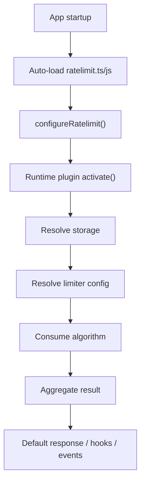
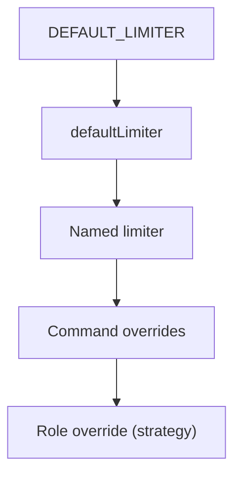
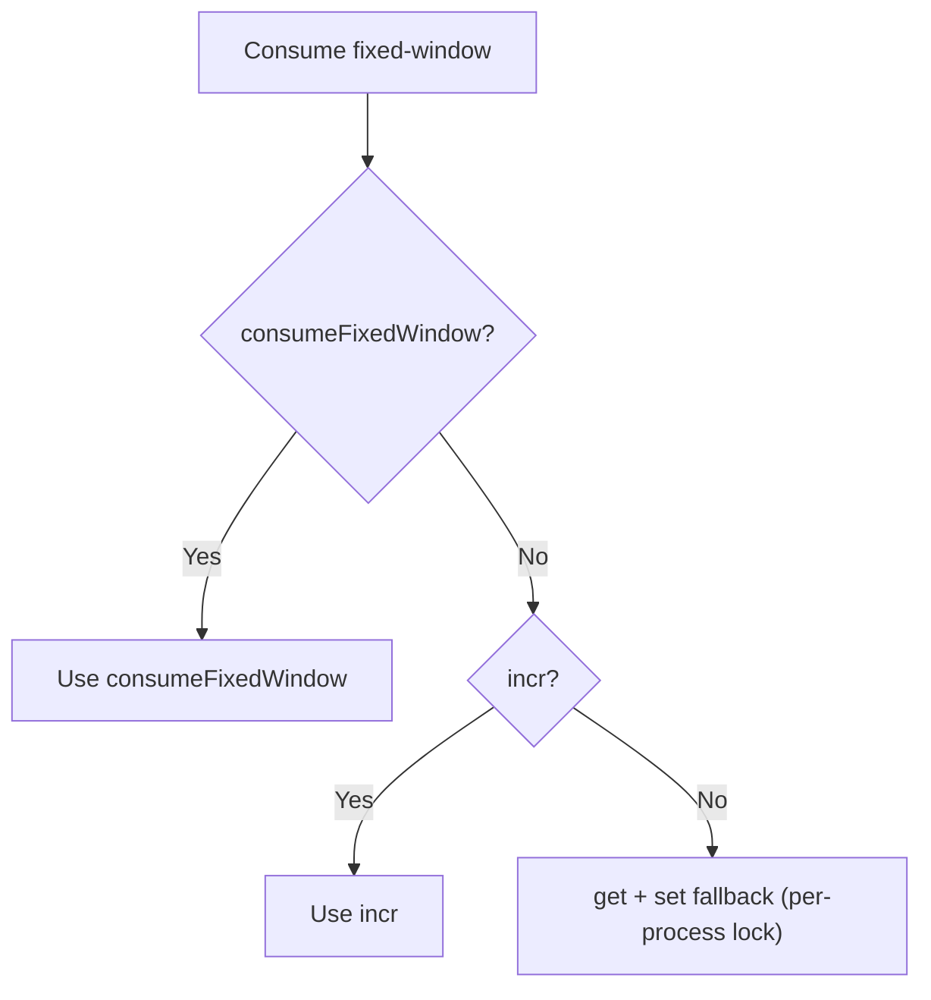
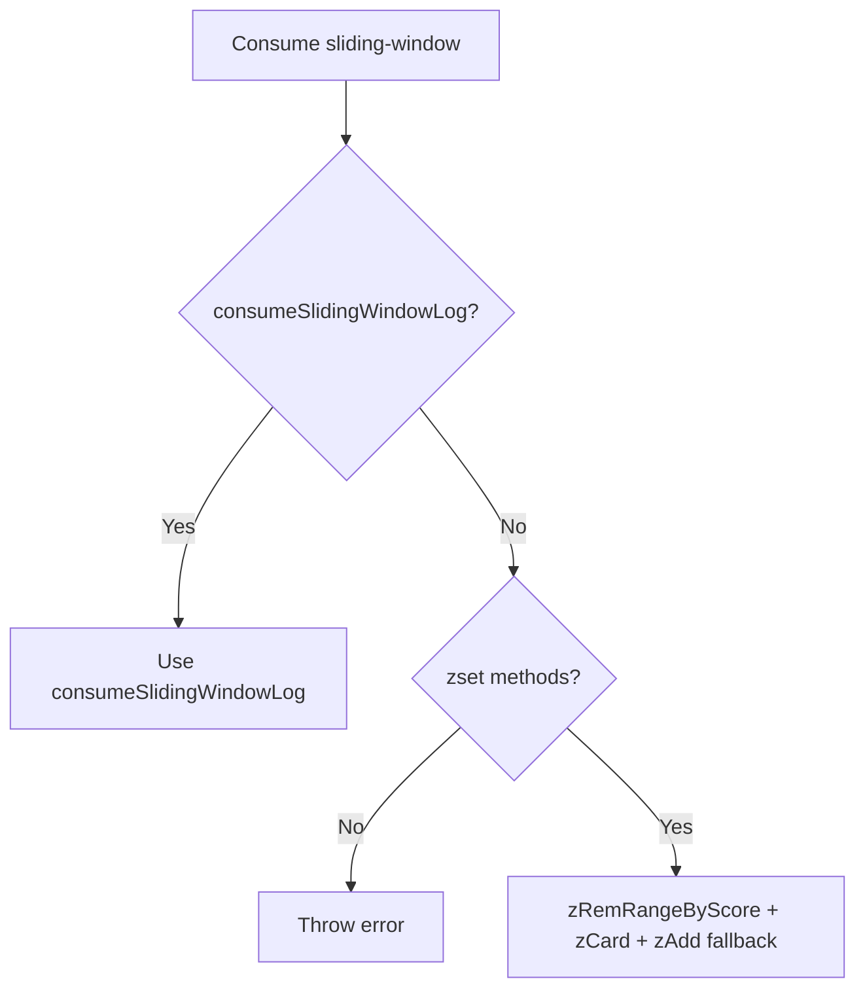
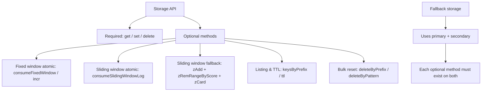
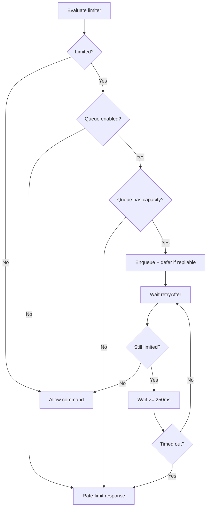

# @commandkit/ratelimit

`@commandkit/ratelimit` is the official CommandKit plugin for advanced rate limiting. It provides multi-window policies, role overrides, queueing, exemptions, and multiple algorithms while keeping command handlers lean.

The `ratelimit()` factory returns two plugins in order: the compiler plugin for the "use ratelimit" directive and the runtime plugin that enforces limits. Runtime options must be configured before the runtime plugin activates.

## Table of contents

1. [Installation](#installation)
2. [Setup](#setup)
3. [Runtime configuration lifecycle](#runtime-configuration-lifecycle)
4. [Basic usage](#basic-usage)
5. [Configuration reference](#configuration-reference)
6. [Limiter resolution and role strategy](#limiter-resolution-and-role-strategy)
7. [Scopes and keying](#scopes-and-keying)
8. [Algorithms](#algorithms)
9. [Storage](#storage)
10. [Queue mode](#queue-mode)
11. [Violations and escalation](#violations-and-escalation)
12. [Bypass and exemptions](#bypass-and-exemptions)
13. [Responses, hooks, and events](#responses-hooks-and-events)
14. [Resets and HMR](#resets-and-hmr)
15. [Directive: `use ratelimit`](#directive-use-ratelimit)
16. [Defaults and edge cases](#defaults-and-edge-cases)
17. [Duration parsing](#duration-parsing)
18. [Exports](#exports)

## Installation

Install the ratelimit plugin to get started:

```bash
npm install @commandkit/ratelimit
```

## Setup

Add the ratelimit plugin to your CommandKit configuration and define a runtime config file.

### Quick start

Create an auto-loaded runtime config file (for example `ratelimit.ts`) and configure the default limiter:

```ts
// ratelimit.ts
import { configureRatelimit } from '@commandkit/ratelimit';

configureRatelimit({
  defaultLimiter: {
    maxRequests: 5,
    interval: '1m',
    scope: 'user',
    algorithm: 'fixed-window',
  },
});
```

Register the plugin in your config:

```ts
// commandkit.config.ts
import { defineConfig } from 'commandkit';
import { ratelimit } from '@commandkit/ratelimit';

export default defineConfig({
  plugins: [ratelimit()],
});
```

The runtime plugin auto-loads `ratelimit.ts` or `ratelimit.js` on startup before commands execute.

## Runtime configuration lifecycle

### Runtime lifecycle diagram



### `configureRatelimit` is required

`RateLimitPlugin.activate()` throws if `configureRatelimit()` was not called. This is enforced to avoid silently running without your intended defaults.

### How configuration is stored

`configureRatelimit()` merges your config into an in-memory object and sets the configured flag. `getRateLimitConfig()` returns the current object, and `isRateLimitConfigured()` returns whether initialization has happened. If a runtime context is already active, `configureRatelimit()` updates it immediately.

### Runtime storage selection

Storage is resolved in this order:

| Order | Source | Notes |
| --- | --- | --- |
| 1 | Limiter `storage` override | `RateLimitLimiterConfig.storage` for the command being executed. |
| 2 | Plugin `storage` option | `RateLimitPluginOptions.storage`. |
| 3 | Process default | Set via `setRateLimitStorage()` or `setDriver()`. |
| 4 | Default memory storage | Used unless `initializeDefaultStorage` or `initializeDefaultDriver` is `false`. |

If no storage is resolved and defaults are disabled, the plugin logs once and stores an empty result without limiting.

### Runtime helpers

These helpers are process-wide:

| Helper | Purpose |
| --- | --- |
| `configureRatelimit` | Set runtime options and update active runtime state. |
| `getRateLimitConfig` | Read the merged in-memory runtime config. |
| `isRateLimitConfigured` | Check whether `configureRatelimit()` was called. |
| `setRateLimitStorage` | Set the default storage for the process. |
| `getRateLimitStorage` | Get the process default storage (or `null`). |
| `setDriver` / `getDriver` | Aliases for `setRateLimitStorage` / `getRateLimitStorage`. |
| `setRateLimitRuntime` | Set the active runtime context for APIs and directives. |
| `getRateLimitRuntime` | Get the active runtime context (or `null`). |

## Basic usage

Use command metadata or the `use ratelimit` directive to enable rate limiting.
This section focuses on command metadata; see the directive section for
function-level usage.

### Command metadata and enablement

Enable rate limiting by setting `metadata.ratelimit`:

```ts
export const metadata = {
  ratelimit: {
    maxRequests: 3,
    interval: '10s',
    scope: 'user',
    algorithm: 'sliding-window',
  },
};
```

`metadata.ratelimit` can be one of:

| Value | Meaning |
| --- | --- |
| `false` or `undefined` | Plugin does nothing for this command. |
| `true` | Enable rate limiting using resolved defaults. |
| `RateLimitCommandConfig` | Enable rate limiting with command-level overrides. |

If `env.context` is missing in the execution environment, the plugin skips rate limiting.

### Named limiter example

```ts
configureRatelimit({
  limiters: {
    heavy: { maxRequests: 1, interval: '10s', algorithm: 'fixed-window' },
  },
});
```

```ts
export const metadata = {
  ratelimit: {
    limiter: 'heavy',
    scope: 'user',
  },
};
```

## Configuration reference

### RateLimitPluginOptions

| Field | Type | Default or resolution | Notes |
| --- | --- | --- | --- |
| `defaultLimiter` | `RateLimitLimiterConfig` | `DEFAULT_LIMITER` when unset | Base limiter for all commands and directives. |
| `limiters` | `Record<string, RateLimitLimiterConfig>` | `undefined` | Named limiter presets. |
| `storage` | `RateLimitStorageConfig` | `undefined` | Resolved before default storage. |
| `keyPrefix` | `string` | `undefined` | Prepended before `rl:`. |
| `keyResolver` | `RateLimitKeyResolver` | `undefined` | Used for `custom` scope when the limiter does not override it. |
| `bypass` | `RateLimitBypassOptions` | `undefined` | Permanent allowlists and optional check. |
| `hooks` | `RateLimitHooks` | `undefined` | Lifecycle callbacks. |
| `onRateLimited` | `RateLimitResponseHandler` | `undefined` | Overrides default reply. |
| `queue` | `RateLimitQueueOptions` | `undefined` | If any queue config exists, `enabled` defaults to `true`. |
| `roleLimits` | `Record<string, RateLimitLimiterConfig>` | `undefined` | Base role limits. |
| `roleLimitStrategy` | `RateLimitRoleLimitStrategy` | `highest` when resolving | Used when multiple roles match. |
| `initializeDefaultStorage` | `boolean` | `true` | Disable to prevent memory fallback. |
| `initializeDefaultDriver` | `boolean` | `true` | Alias for `initializeDefaultStorage`. |

### RateLimitLimiterConfig

| Field | Type | Default or resolution | Notes |
| --- | --- | --- | --- |
| `maxRequests` | `number` | `10` when missing or `<= 0` | Used by fixed and sliding windows. |
| `interval` | `DurationLike` | `60s` when missing or invalid | Parsed and clamped to `>= 1ms`. |
| `scope` | `RateLimitScope` or `RateLimitScope[]` | `user` | Arrays are deduplicated. |
| `algorithm` | `RateLimitAlgorithmType` | `fixed-window` | Unknown values fall back to fixed-window. |
| `burst` | `number` | `maxRequests` when missing or `<= 0` | Capacity for token or leaky buckets. |
| `refillRate` | `number` | `maxRequests / intervalSeconds` | Must be `> 0` for token bucket. |
| `leakRate` | `number` | `maxRequests / intervalSeconds` | Must be `> 0` for leaky bucket. |
| `keyResolver` | `RateLimitKeyResolver` | `undefined` | Used only for `custom` scope. |
| `keyPrefix` | `string` | `undefined` | Overrides plugin prefix for this limiter. |
| `storage` | `RateLimitStorageConfig` | `undefined` | Overrides storage for this limiter. |
| `violations` | `ViolationOptions` | `undefined` | Enables escalation unless `escalate` is `false`. |
| `queue` | `RateLimitQueueOptions` | `undefined` | Overrides queue settings at this layer. |
| `windows` | `RateLimitWindowConfig[]` | `undefined` | Enables multi-window behavior. |
| `roleLimits` | `Record<string, RateLimitLimiterConfig>` | `undefined` | Role overrides at this layer. |
| `roleLimitStrategy` | `RateLimitRoleLimitStrategy` | `highest` when resolving | Used when role limits match. |

### RateLimitWindowConfig

| Field | Type | Default or resolution | Notes |
| --- | --- | --- | --- |
| `id` | `string` | `w1`, `w2`, ... | Auto-generated if empty or missing. |
| `maxRequests` | `number` | Inherits from base limiter | Applies only to this window. |
| `interval` | `DurationLike` | Inherits from base limiter | Parsed like the base limiter. |
| `algorithm` | `RateLimitAlgorithmType` | Inherits from base limiter | Usually keep consistent across windows. |
| `burst` | `number` | Inherits from base limiter | Used for token or leaky buckets. |
| `refillRate` | `number` | Inherits from base limiter | Must be `> 0` for token bucket. |
| `leakRate` | `number` | Inherits from base limiter | Must be `> 0` for leaky bucket. |
| `violations` | `ViolationOptions` | Inherits from base limiter | Overrides escalation for this window. |

### RateLimitQueueOptions

| Field | Type | Default or resolution | Notes |
| --- | --- | --- | --- |
| `enabled` | `boolean` | `true` when any queue config exists | Otherwise `false`. |
| `maxSize` | `number` | `3` and clamped to `>= 1` | Queue size is pending plus running. |
| `timeout` | `DurationLike` | `30s` and clamped to `>= 1ms` | Per queued task. |
| `deferInteraction` | `boolean` | `true` unless explicitly `false` | Only used for interactions. |
| `ephemeral` | `boolean` | `true` unless explicitly `false` | Applies to deferred replies. |
| `concurrency` | `number` | `1` and clamped to `>= 1` | Per queue key. |

### ViolationOptions

| Field | Type | Default or resolution | Notes |
| --- | --- | --- | --- |
| `escalate` | `boolean` | `true` when `violations` is set | Set `false` to disable escalation. |
| `maxViolations` | `number` | `5` | Maximum escalation steps. |
| `escalationMultiplier` | `number` | `2` | Multiplies cooldown per repeated violation. |
| `resetAfter` | `DurationLike` | `1h` | TTL for violation state. |

### RateLimitCommandConfig

`RateLimitCommandConfig` extends `RateLimitLimiterConfig` and adds:

| Field | Type | Default or resolution | Notes |
| --- | --- | --- | --- |
| `limiter` | `string` | `undefined` | References a named limiter in `limiters`. |

### Result shapes

RateLimitStoreValue:

| Field | Type | Meaning |
| --- | --- | --- |
| `limited` | `boolean` | `true` if any scope or window was limited. |
| `remaining` | `number` | Minimum remaining across all results. |
| `resetAt` | `number` | Latest reset timestamp across all results. |
| `retryAfter` | `number` | Max retry delay across limited results. |
| `results` | `RateLimitResult[]` | Individual results per scope and window. |

RateLimitResult:

| Field | Type | Meaning |
| --- | --- | --- |
| `key` | `string` | Storage key used for the limiter. |
| `scope` | `RateLimitScope` | Scope applied for the limiter. |
| `algorithm` | `RateLimitAlgorithmType` | Algorithm used for the limiter. |
| `windowId` | `string` | Present for multi-window limits. |
| `limited` | `boolean` | Whether this limiter hit its limit. |
| `remaining` | `number` | Remaining requests or capacity. |
| `resetAt` | `number` | Absolute reset timestamp in ms. |
| `retryAfter` | `number` | Delay until retry is allowed, in ms. |
| `limit` | `number` | `maxRequests` for fixed and sliding, `burst` for token and leaky buckets. |

## Limiter resolution and role strategy

Limiter configuration is layered in this exact order, with later layers overriding earlier ones:

| Order | Source | Notes |
| --- | --- | --- |
| 1 | `DEFAULT_LIMITER` | Base defaults. |
| 2 | `defaultLimiter` | Runtime defaults. |
| 3 | Named limiter | When `metadata.ratelimit.limiter` is set. |
| 4 | Command overrides | `metadata.ratelimit` config. |
| 5 | Role override | Selected by role strategy. |

### Limiter resolution diagram



Role limits are merged in this order, with later maps overriding earlier ones for the same role id:

| Order | Source |
| --- | --- |
| 1 | Plugin `roleLimits` |
| 2 | `defaultLimiter.roleLimits` |
| 3 | Named limiter `roleLimits` |
| 4 | Command `roleLimits` |

Role strategies:

| Strategy | Selection rule |
| --- | --- |
| `highest` | Picks the role with the highest request rate (`maxRequests / intervalMs`). |
| `lowest` | Picks the role with the lowest request rate. |
| `first` | Uses insertion order of the merged role limits object. |

For multi-window limiters, the score uses the minimum rate across windows.

## Scopes and keying

Supported scopes:

| Scope | Required IDs | Key format (without `keyPrefix`) | Skip behavior |
| --- | --- | --- | --- |
| `user` | `userId` | `rl:user:{userId}:{commandName}` | Skips if `userId` is missing. |
| `guild` | `guildId` | `rl:guild:{guildId}:{commandName}` | Skips if `guildId` is missing. |
| `channel` | `channelId` | `rl:channel:{channelId}:{commandName}` | Skips if `channelId` is missing. |
| `global` | none | `rl:global:{commandName}` | Never skipped. |
| `user-guild` | `userId`, `guildId` | `rl:user:{userId}:guild:{guildId}:{commandName}` | Skips if either id is missing. |
| `custom` | `keyResolver` | `keyResolver(ctx, command, source)` | Skips if resolver is missing or returns falsy. |

Keying notes:

- `DEFAULT_KEY_PREFIX` is always included in the base format.
- `keyPrefix` is concatenated before `rl:` as-is, so include a trailing separator if you want one.
- Multi-window limits append `:w:{windowId}`.

### Exemption keys

Temporary exemptions are stored under `rl:exempt:{scope}:{id}` (plus optional `keyPrefix`).

| Exemption scope | Key format | Notes |
| --- | --- | --- |
| `user` | `rl:exempt:user:{userId}` | Resolved from the source user id. |
| `guild` | `rl:exempt:guild:{guildId}` | Resolved from the guild id. |
| `role` | `rl:exempt:role:{roleId}` | Resolved from all member roles. |
| `channel` | `rl:exempt:channel:{channelId}` | Resolved from the channel id. |
| `category` | `rl:exempt:category:{categoryId}` | Resolved from the parent category id. |

## Algorithms

### Algorithm matrix

| Algorithm | Required config | Storage requirements | `limit` value | Notes |
| --- | --- | --- | --- | --- |
| `fixed-window` | `maxRequests`, `interval` | `consumeFixedWindow` or `incr` or `get` and `set` | `maxRequests` | Fallback uses per-process lock and optimistic versioning. |
| `sliding-window` | `maxRequests`, `interval` | `consumeSlidingWindowLog` or `zRemRangeByScore` + `zCard` + `zAdd` | `maxRequests` | Throws if sorted-set support is missing. |
| `token-bucket` | `burst`, `refillRate` | `get` and `set` | `burst` | Throws if `refillRate <= 0`. |
| `leaky-bucket` | `burst`, `leakRate` | `get` and `set` | `burst` | Throws if `leakRate <= 0`. |

### Fixed window

Execution path:

1. If `consumeFixedWindow` exists, it is used.
2. Else if `incr` exists, it is used.
3. Else a fallback uses `get` and `set` with a per-process lock.

The limiter is considered limited when `count > maxRequests`. The fallback path retries up to five times with optimistic versioning and is serialized only within the current process.

#### Fixed window fallback diagram



### Sliding window log

Execution path:

1. If `consumeSlidingWindowLog` exists, it is used (atomic).
2. Else a sorted-set fallback uses `zRemRangeByScore`, `zCard`, and `zAdd`.

If sorted-set methods are missing, the algorithm throws. If `zRangeByScore` is available, it is used to compute an accurate oldest timestamp for `resetAt`; otherwise `resetAt` defaults to `now + window`. The fallback is serialized per process but is not atomic across processes.

#### Sliding window fallback diagram



### Token bucket

Token bucket uses a stored `tokens` and `lastRefill` state. On each consume, tokens refill based on elapsed time and `refillRate`. If the bucket has fewer than one token, the request is limited and `retryAfter` is computed from the time required to refill one token.

### Leaky bucket

Leaky bucket uses a stored `level` and `lastLeak` state. Each request adds one token, and the bucket drains at `leakRate`. If adding would exceed `capacity`, the request is limited and `retryAfter` is computed from the time required to drain the overflow.

### Multi-window limits

Use `windows` to enforce multiple windows simultaneously:

```ts
configureRatelimit({
  defaultLimiter: {
    scope: 'user',
    algorithm: 'sliding-window',
    windows: [
      { id: 'short', maxRequests: 10, interval: '1m' },
      { id: 'long', maxRequests: 1000, interval: '1d' },
    ],
  },
});
```

If a window `id` is omitted, the plugin generates `w1`, `w2`, and so on. Window ids are part of the storage key and appear in results.

## Storage

### Storage interface

Required methods:

| Method | Used by | Notes |
| --- | --- | --- |
| `get` | All algorithms | Returns stored value or `null`. |
| `set` | All algorithms | Optional `ttlMs` controls expiry. |
| `delete` | Resets and algorithm resets | Removes stored state. |

Optional methods and features:

| Method | Feature | Notes |
| --- | --- | --- |
| `consumeFixedWindow` | Fixed-window atomic consume | Used before `incr` and fallback. |
| `incr` | Fixed-window efficiency | Returns count and TTL. |
| `consumeSlidingWindowLog` | Sliding-window atomic consume | Preferred over sorted-set fallback. |
| `zAdd` / `zRemRangeByScore` / `zCard` | Sliding-window fallback | Required when `consumeSlidingWindowLog` is absent. |
| `zRangeByScore` | Sliding-window reset accuracy | Improves `resetAt` computation. |
| `ttl` | Exemption listing | Used for `expiresInMs`. |
| `expire` | Sliding-window fallback | Keeps sorted-set keys from growing indefinitely. |
| `deleteByPrefix` / `deleteByPattern` | Resets | Required by `resetAllRateLimits` and HMR. |
| `keysByPrefix` | Exemption listing | Required for listing without a specific id. |

### Capability matrix

| Feature | Requires | Memory | Redis | Fallback |
| --- | --- | --- | --- | --- |
| Fixed-window atomic consume | `consumeFixedWindow` | Yes | Yes | Conditional (both storages) |
| Fixed-window `incr` | `incr` | Yes | Yes | Conditional (both storages) |
| Sliding-window atomic consume | `consumeSlidingWindowLog` | Yes | Yes | Conditional (both storages) |
| Sliding-window fallback | `zAdd` + `zRemRangeByScore` + `zCard` | Yes | Yes | Conditional (both storages) |
| TTL visibility | `ttl` | Yes | Yes | Conditional (both storages) |
| Prefix or pattern deletes | `deleteByPrefix` or `deleteByPattern` | Yes | Yes | Conditional (both storages) |
| Exemption listing | `keysByPrefix` | Yes | Yes | Conditional (both storages) |

### Capability overview diagram



### Memory storage

```ts
import { MemoryRateLimitStorage, setRateLimitStorage } from '@commandkit/ratelimit';

setRateLimitStorage(new MemoryRateLimitStorage());
```

Notes:

- In-memory only; not safe for multi-process deployments.
- Implements TTL and sorted-set helpers.
- `deleteByPattern` supports a simple `*` wildcard, not full glob syntax.

### Redis storage

```ts
import { RedisRateLimitStorage } from '@commandkit/ratelimit/redis';
import { setRateLimitStorage } from '@commandkit/ratelimit';

setRateLimitStorage(
  new RedisRateLimitStorage({ host: 'localhost', port: 6379 }),
);
```

Notes:

- Stores values as JSON.
- Uses Lua scripts for atomic fixed and sliding windows.
- Uses `SCAN` for prefix and pattern deletes and listing.

### Fallback storage

```ts
import { FallbackRateLimitStorage } from '@commandkit/ratelimit/fallback';
import { MemoryRateLimitStorage } from '@commandkit/ratelimit/memory';
import { RedisRateLimitStorage } from '@commandkit/ratelimit/redis';
import { setRateLimitStorage } from '@commandkit/ratelimit';

const primary = new RedisRateLimitStorage({ host: 'localhost', port: 6379 });
const secondary = new MemoryRateLimitStorage();

setRateLimitStorage(new FallbackRateLimitStorage(primary, secondary));
```

Notes:

- Every optional method must exist on both storages or the fallback wrapper throws.
- Primary errors are logged at most once per `cooldownMs` window (default 30s).

## Queue mode

Queue mode retries commands instead of rejecting immediately.

### Queue defaults and clamps

| Field | Default | Clamp | Notes |
| --- | --- | --- | --- |
| `enabled` | `true` if any queue config exists | n/a | Otherwise `false`. |
| `maxSize` | `3` | `>= 1` | Queue size is pending plus running. |
| `timeout` | `30s` | `>= 1ms` | Per queued task. |
| `deferInteraction` | `true` | n/a | Only applies to interactions. |
| `ephemeral` | `true` | n/a | Applies to deferred replies. |
| `concurrency` | `1` | `>= 1` | Per queue key. |

### Queue flow

1. Rate limit is evaluated and an aggregate result is computed.
2. If limited and queueing is enabled, the plugin tries to enqueue.
3. If the queue is full, it falls back to immediate rate-limit handling.
4. When queued, the interaction is deferred if it is repliable and not already replied or deferred.
5. The queued task waits `retryAfter`, then re-checks the limiter; if still limited it waits at least 250ms and retries until timeout.

### Queue flow diagram



## Violations and escalation

Violation escalation is stored under `violation:{key}` and uses these defaults:

| Option | Default | Meaning |
| --- | --- | --- |
| `maxViolations` | `5` | Maximum escalation steps. |
| `escalationMultiplier` | `2` | Multiplier per repeated violation. |
| `resetAfter` | `1h` | TTL for violation state. |
| `escalate` | `true` when `violations` is set | Set `false` to disable escalation. |

Formula:

`cooldown = baseRetryAfter * multiplier^(count - 1)`

If escalation produces a later `resetAt` than the algorithm returned, the result is updated so `resetAt` and `retryAfter` stay accurate.

## Bypass and exemptions

Bypass order is always:

1. `bypass.userIds`, `bypass.guildIds`, and `bypass.roleIds`.
2. Temporary exemptions stored in storage.
3. `bypass.check(source)`.

Bypass example:

```ts
configureRatelimit({
  bypass: {
    userIds: ['USER_ID'],
    guildIds: ['GUILD_ID'],
    roleIds: ['ROLE_ID'],
    check: (source) => source.channelId === 'ALLOWLIST_CHANNEL',
  },
});
```

Temporary exemptions:

```ts
import { grantRateLimitExemption } from '@commandkit/ratelimit';

await grantRateLimitExemption({
  scope: 'user',
  id: 'USER_ID',
  duration: '1h',
});
```

Listing behavior:

- `listRateLimitExemptions({ scope, id })` reads a single key directly.
- `listRateLimitExemptions({ scope })` scans by prefix and requires `keysByPrefix`.
- `expiresInMs` is `null` when `ttl` is not supported.

## Responses, hooks, and events

### Default response behavior

| Source | Conditions | Action |
| --- | --- | --- |
| Message | Channel is sendable | `reply()` with cooldown embed. |
| Interaction | Repliable and not replied/deferred | `reply()` with ephemeral cooldown embed. |
| Interaction | Repliable and already replied/deferred | `followUp()` with ephemeral cooldown embed. |
| Interaction | Not repliable | No response. |

The default embed title is `:hourglass_flowing_sand: You are on cooldown` and the description uses a relative timestamp based on `resetAt`.

### Hooks

| Hook | Called when | Notes |
| --- | --- | --- |
| `onAllowed` | Command is allowed | Receives the first result. |
| `onRateLimited` | Command is limited | Receives the first limited result. |
| `onViolation` | A violation is recorded | Receives key and violation count. |
| `onReset` | `resetRateLimit` succeeds | Not called by `resetAllRateLimits`. |
| `onStorageError` | Storage operation fails | `fallbackUsed` is `false` in runtime plugin paths. |

### Analytics events

The runtime plugin calls `ctx.commandkit.analytics.track(...)` with:

| Event name | When |
| --- | --- |
| `ratelimit_allowed` | After an allowed consume. |
| `ratelimit_hit` | After a limited consume. |
| `ratelimit_violation` | When escalation records a violation. |

### Event bus

A `ratelimited` event is emitted on the `ratelimits` channel:

```ts
commandkit.events
  .to('ratelimits')
  .on('ratelimited', ({ key, result, source, aggregate, commandName, queued }) => {
    console.log(key, commandName, queued, aggregate.retryAfter);
  });
```

Payload fields include `key`, `result`, `source`, `aggregate`, `commandName`, and `queued`.

## Resets and HMR

### `resetRateLimit`

`resetRateLimit` clears the base key, its `violation:` key, and any window variants. It accepts either a raw `key` or a scope-derived key.

| Mode | Required params | Notes |
| --- | --- | --- |
| Direct | `key` | Resets `key`, `violation:key`, and window variants. |
| Scoped | `scope` + `commandName` + required ids | Throws if identifiers are missing. |

### `resetAllRateLimits`

`resetAllRateLimits` supports several modes and requires storage delete helpers:

| Mode | Required params | Storage requirement |
| --- | --- | --- |
| Pattern | `pattern` | `deleteByPattern` |
| Prefix | `prefix` | `deleteByPrefix` |
| Command name | `commandName` | `deleteByPattern` |
| Scope | `scope` + required ids | `deleteByPrefix` |

### HMR reset behavior

When a command file is hot-reloaded, the plugin deletes keys that match:

- `*:{commandName}`
- `violation:*:{commandName}`
- `*:{commandName}:w:*`
- `violation:*:{commandName}:w:*`

HMR reset requires `deleteByPattern`. If the storage does not support pattern deletes, nothing is cleared.

## Directive: `use ratelimit`

The compiler plugin (`UseRateLimitDirectivePlugin`) uses `CommonDirectiveTransformer` with `directive = "use ratelimit"` and `importName = "$ckitirl"`. It transforms async functions only.

The runtime wrapper:

- Uses the runtime default limiter (merged with `DEFAULT_LIMITER`).
- Generates a per-function key `rl:fn:{uuid}` and applies `keyPrefix` if present.
- Aggregates results across windows and throws `RateLimitError` when limited.
- Caches the wrapper per function and exposes it as `globalThis.$ckitirl`.

Example:

```ts
import { RateLimitError } from '@commandkit/ratelimit';

const heavy = async () => {
  'use ratelimit';
  return 'ok';
};

try {
  await heavy();
} catch (error) {
  if (error instanceof RateLimitError) {
    console.log(error.result.retryAfter);
  }
}
```

## Defaults and edge cases

### Defaults

| Setting | Default |
| --- | --- |
| `maxRequests` | `10` |
| `interval` | `60s` |
| `algorithm` | `fixed-window` |
| `scope` | `user` |
| `DEFAULT_KEY_PREFIX` | `rl:` |
| `RATELIMIT_STORE_KEY` | `ratelimit` |
| `roleLimitStrategy` | `highest` |
| `queue.maxSize` | `3` |
| `queue.timeout` | `30s` |
| `queue.deferInteraction` | `true` |
| `queue.ephemeral` | `true` |
| `queue.concurrency` | `1` |
| `initializeDefaultStorage` | `true` |

### Edge cases

1. If no storage is configured and default storage is disabled, the plugin logs once and stores an empty result without limiting.
2. If no scope key can be resolved, the plugin stores an empty result and skips limiting.
3. If storage errors occur during consume, `onStorageError` is invoked and the plugin skips limiting for that execution.
4. For token and leaky buckets, `limit` equals `burst`. For fixed and sliding windows, `limit` equals `maxRequests`.

## Duration parsing

`DurationLike` accepts numbers (milliseconds) or strings parsed by `ms`, plus custom units for weeks and months.

| Unit | Meaning |
| --- | --- |
| `ms`, `s`, `m`, `h`, `d` | Standard `ms` units. |
| `w`, `week`, `weeks` | 7 days. |
| `mo`, `month`, `months` | 30 days. |

## Exports

| Export | Description |
| --- | --- |
| `ratelimit` | Plugin factory returning compiler + runtime plugins. |
| `RateLimitPlugin` | Runtime plugin class. |
| `UseRateLimitDirectivePlugin` | Compiler plugin for `use ratelimit`. |
| `RateLimitEngine` | Algorithm coordinator with escalation handling. |
| Algorithm classes | Fixed, sliding, token bucket, and leaky bucket implementations. |
| Storage classes | Memory, Redis, and fallback storage. |
| Runtime helpers | `configureRatelimit`, `setRateLimitStorage`, `getRateLimitRuntime`, and more. |
| API helpers | `getRateLimitInfo`, resets, and exemption helpers. |
| `RateLimitError` | Error thrown by the directive wrapper. |

Subpath exports:

- `@commandkit/ratelimit/redis`
- `@commandkit/ratelimit/memory`
- `@commandkit/ratelimit/fallback`


